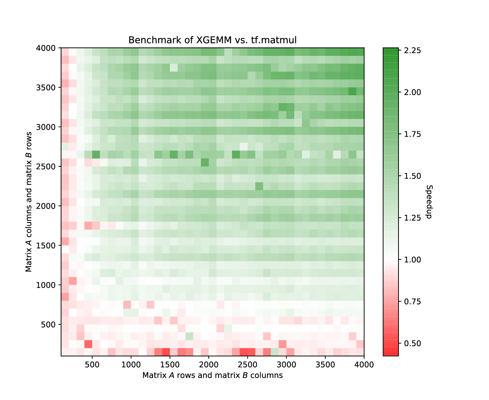
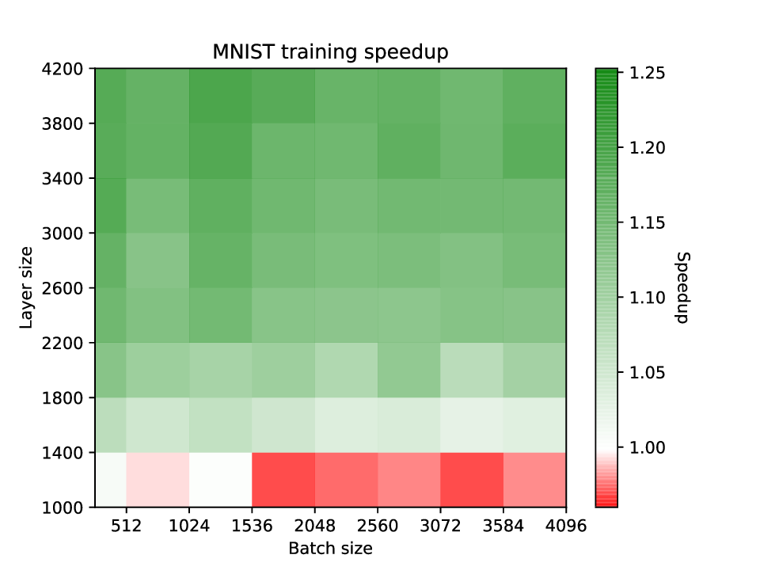

# TensorFlow XNOR-net

This repository so far contains 3 custom tensorflow operators and
provides python interface for their integration into tensorflow models.
Follow steps in the setup section to make sure you can use these.
Hopefully it will not drive you crazy.

## Setup

Firstly you need to build the shared library with the operators. Change to
`operators` directory and follow steps in the README file there. To make sure
everything works fine, run:

```bash
python3 run_tests.py --all
```

That will execute all tests. To see testing options run:

```bash
python3 run_tests.py -h
```


## Benchmarks

Benchmarks were executed on NVIDIA GeForce 940MX, 2GB GPU.

Implemented XGEMM was compared with `tf.matmul` operator. XGEMM is real GEMM
(can multiply any matrices, not just multiples of 512...). It achieved relatively
good speedup of almost 2.5 on 4k by 4k inputs.



To reproduce this benchmark, run

```bash
python3 run_benchmarks.py
```

#### XGEMM in MNIST

Operators were used in 4-layer MLP MNIST classifier and compared with full-precision
counterpart. Binarized network achieved speedup by 25% during the training. Accuracy
drop was on average around 5.5%. 



You can experiment with MNIST models by running

```bash
python3 run_mnist.py [MODEL] --learning_rate [LR] --batch_size=[BS] --hidden_size=[HS] --steps=[S]
```

* MODEL - one of `--full_precision`, `--binary_concept`, `--binary_xgemm`.
* LR, BS, HS, S - anything you want
* run `python3 run_mnist.py -h` for help

## Bugs

- CUDA for some reason fails to even call GPU kernels if input
  dimensions are too high (around 5000 for 32 size tiles in all operators). Why?


## TODOs

- further optimize XGEMM
- optimize binarizations and add custom `qtype` for columns
- XGEMM use transpose flags
- implement fully binarized convolutional layer
