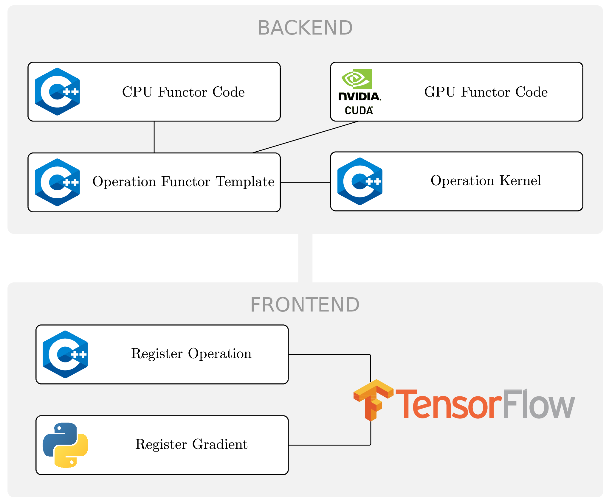

# TensorFlow operators

This part of the project contains TensorFlow custom operator implementations
for XNOR-net based models. 

### Implemented operators

 * Matrix row binarization \[GPU and CPU]
 * Matrix column binarization with built-in transposition \[GPU only]
 * XNOR-based general matrix multiplication or **XGEMM** \[GPU only]

### Requirements

You need to have CUDA capable GPU, installed Tensorflow and CUDA. This setting
work for me on Fedora 27, `CUDA v9.1`, `cuDNN v7.0.5` and `Tensorflow v1.5.0-rc0`.
I am using TensorFlow virtualenv as described in the Tensorflow manuals.

```bash
$ nvcc --version
Cuda compilation tools, release 9.1, V9.1.85
```

```bash
$ python3       
>>> import tensorflow as tf
>>> tf.__version__
'1.5.0-rc0'
```

To compile custom operators, you need to manually modify the attached Makefile
and obviously have `g++` ready. 

```bash
export TF_CFLAGS=( $(python -c 'import tensorflow as tf; print(" ".join(tf.sysconfig.get_compile_flags()))') )
export TF_LFLAGS=( $(python -c 'import tensorflow as tf; print(" ".join(tf.sysconfig.get_link_flags()))') )
```

If you have trouble with cuda config during the compilation, you might have to manually
include the path to it that might look like this. (`/home/lslouka/tensorflow/`) is path
to `tensorflow` virtualenv on my machine.

```bash
TF_CUDA_CONFIG=-I/home/lslouka/tensorflow/lib/python3.6/site-packages/external/local_config_cuda/cuda
```

### Building the library

If you have all the required libraries, tools and what not, just run `make`. To clean
up run `make clean`. If you successfully build `operators.so`, congratulations.


### Creating new operators

Addition of new operators is standardized according
to this rough scheme describing all the parts:



All parts should be in a separate part. All parts except for gradient registration
are done in this directory. Gradients are registered in the `op_interface` in python.